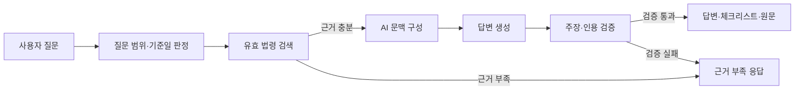
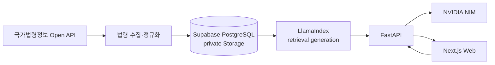

# law-rag

국가법령정보 공동활용 Open API의 공식 원문을 바탕으로, 질문 기준일에 유효한 에너지 법령을 찾고 답변의 주장과 인용을 검증하는 법률 RAG 서비스입니다.

**[서비스 사용하기](https://law-rag-web.vercel.app/)** · [아키텍처](ARCHITECTURE.md) · [제품 명세](docs/product-specs/grounded-legal-qa.md) · [신뢰성 목표](docs/RELIABILITY.md)

> 법령을 그럴듯하게 설명하는 것보다, 어떤 원문을 근거로 답했는지 확인할 수 있는 것을 우선합니다.

## 왜 만들었나

법률 질문은 자연스러운 문장을 생성하는 것만으로 해결되지 않습니다.

- 질문한 날짜에 실제로 유효한 조문인지 확인할 수 있어야 합니다.
- 답변의 실질적인 주장이 공식 법령 원문과 연결되어야 합니다.
- 검색 근거가 충분하지 않으면 모델의 기억으로 법률 내용을 보완하지 않아야 합니다.
- 법령과 검색 방식이 바뀌어도 어떤 데이터와 설정으로 답했는지 추적할 수 있어야 합니다.

law-rag는 **공식 법령 수집 → 시점별 버전 관리 → 조문 검색 → 근거 기반 생성 → 인용 검증**을 하나의 흐름으로 연결합니다. AI 또는 검색 계층이 준비되지 않은 상태도 정상 답변처럼 감추지 않고 명시적인 상태로 처리합니다.

## 직접 사용해 보기

### 1. 질문하기

**[law-rag 웹 서비스](https://law-rag-web.vercel.app/)**를 열고 에너지 사업이나 관련 법령에 관한 질문을 입력합니다. 법령을 확인할 날짜가 중요하다면 질문 입력창의 `기준일`을 지정할 수 있습니다.

예를 들어 다음과 같이 질문할 수 있습니다.

- 태양광 발전사업을 시작하려면 어떤 허가를 확인해야 하나요?
- 전기사업 허가를 받을 때 검토되는 기준은 무엇인가요?
- 분산에너지 사업 등록과 관련된 법률 근거를 알려주세요.
- 전기저장시설에 적용되는 화재안전 기준을 알려주세요.

### 2. 답변과 확인 항목 읽기

답변은 검색된 근거 안에서 설명과 확인 체크리스트를 구성합니다. 사업 단계나 사실관계에 따라 추가 확인이 필요한 내용은 체크리스트에서 이어서 살펴볼 수 있습니다.

### 3. 원문 근거 확인하기

답변에 표시된 인용 ID를 선택하면 해당 법령명, 조문 경로와 원문을 확인할 수 있습니다. 결과가 `근거 부족`으로 표시되면 법령명, 사업 단계, 허가·신고 등 확인하려는 쟁점을 포함해 질문을 더 구체적으로 작성합니다.

### 4. 질문 이력 이어 보기

익명으로도 질문할 수 있습니다. Google 계정으로 로그인하면 로그인 이후의 질문과 답변을 다시 열어볼 수 있으며, 저장된 질문 이력은 생성일부터 1년간 보관됩니다.

## 답변을 읽는 방법

| 화면 요소 | 의미 |
|---|---|
| `기준일` | 법령의 유효성을 판단하는 날짜 |
| `AI 답변 · 인용 검증` | 검색된 원문으로 답변을 생성하고 인용 구조 검증까지 통과한 결과 |
| `확인 체크리스트` | 실제 상황에 적용하기 전에 추가로 확인할 절차·조건 |
| `원문 근거` | 답변의 인용 ID와 연결된 법령명·조문·원문 |
| `근거 부족` | 현재 공식 원문과 검색 결과만으로 답하기 어려운 상태 |

법령명이나 조문 번호를 이미 알고 있다면 질문에 함께 적는 것이 좋습니다. 상황형 질문은 사업 종류, 진행 단계, 지역, 설비 유형과 확인하려는 행정행위를 구체적으로 적을수록 관련 근거를 찾기 쉽습니다.

## 핵심 기능

- **기준일 검색** — 질문 날짜에 유효한 법령 버전만 검색 대상으로 제한합니다.
- **공식 원문 인용** — 답변에서 인용한 법령과 조문 원문을 함께 제공합니다.
- **근거 기반 생성** — 검색·출처 검증을 통과한 조문만 생성 모델에 전달합니다.
- **답변 안전 게이트** — 답변의 실질적 주장과 체크리스트가 제공된 인용 ID를 가리키는지 검사합니다.
- **명시적 실패 처리** — 근거 부족, 지원 범위 밖 기준일, 검색 준비 실패와 AI 장애를 서로 다른 상태로 처리합니다.
- **데이터 계보** — 원문 버전, 청크, 임베딩 프로필, corpus snapshot과 retrieval generation을 연결합니다.
- **대화 수명주기** — 질문 준비, 검색, 생성, 검증, 완료와 취소 단계를 영속 실행 상태로 관리합니다.
- **사용자 데이터 통제** — 익명 질문은 저장하지 않고, 계정 삭제 시 연결된 사용자 데이터를 함께 삭제합니다.

## 신뢰성 원칙

| 원칙 | 구현 방식 |
|---|---|
| 공식 출처 | 법률 corpus를 국가법령정보 공동활용 Open API로 제한합니다. HTML, PDF와 다른 법률 사이트로 우회하지 않습니다. |
| 시점 일관성 | 시행일과 종료일을 기준으로 질문 기준일에 유효한 버전을 선택합니다. |
| 근거 제한 | 검색되지 않은 법률 내용을 모델의 사전 지식으로 보완하지 않습니다. |
| 인용 검증 | 답변 section과 체크리스트의 인용 ID가 실제 검색 근거를 가리키는지 검사합니다. |
| 원자적 공개 | 새 corpus와 검색 세대는 전체 검증이 끝난 뒤에만 활성 상태로 전환합니다. |
| 재현 가능성 | 평가 결과에 dataset, code, corpus snapshot과 retrieval release 계보를 기록합니다. |
| 장애 격리 | 검색 준비 상태, 질문 라우팅, 임베딩, 생성과 검증 실패를 단계별 reason code로 구분합니다. |
| 개인정보 보호 | 인증정보, 질문 원문, IP와 법령 원문 전문을 애플리케이션 로그에 남기지 않습니다. |

## 사용자 질문 처리 과정



1. **질문 판정** — 단일 typed router가 법률 검색, 추가 설명 필요, 실시간 정보 필요, 외부 문서 필요를 구분합니다.
2. **시간 범위 검증** — 기준일이 현재 corpus가 지원하는 범위 안인지 검색 전에 검사합니다.
3. **근거 검색** — 법령명·조문이 명시된 질문은 직접 경로를 우선하고, 일반 질문은 의미 검색으로 관련 조문을 찾습니다.
4. **출처 검증** — 국가법령정보 공식 HTTPS 출처가 아닌 검색 결과를 생성 문맥에서 제외합니다.
5. **답변 생성** — 검증된 원문만 모델에 전달해 설명, 확인 항목과 인용 ID를 구조화된 결과로 생성합니다.
6. **답변 검증** — 응답 구조와 모든 인용 ID를 검사한 뒤 통과한 결과만 사용자에게 제공합니다.

## 시스템 아키텍처



| 구성요소 | 책임 |
|---|---|
| Next.js Web | 질문 입력, 기준일 선택, 실행 상태, 답변·체크리스트·원문 인용과 질문 이력을 표시합니다. |
| FastAPI | 질문 수명주기와 라우팅·검색·생성·검증 단계를 조율하고 공개 API 계약을 제공합니다. |
| Collector | 공식 Open API 응답을 JSON 우선/XML 폴백으로 검증하고 법령 버전과 원문 해시를 보존합니다. |
| LlamaIndex retrieval | 조문을 generation 단위로 색인하고 검증된 활성 generation에서 근거를 조회합니다. |
| LangGraph agent | 별도 V3 경로에서 대화 상태와 검색·생성·검증 node를 명시적인 상태 전이로 실행합니다. |
| PostgreSQL·Storage | 법령, 원문, 조문, 벡터, 검색 세대, 질문 실행과 사용자 데이터의 영속 계보를 관리합니다. |
| NVIDIA NIM | 질문 라우팅, query embedding과 구조화된 답변 생성을 담당합니다. |

의존성은 `domain → application → ports ← adapters → delivery` 방향을 따릅니다. 도메인 계층은 FastAPI, SQLAlchemy와 외부 AI SDK에 직접 의존하지 않으며, 브라우저는 NVIDIA와 Supabase service role에 직접 접근하지 않습니다. 자세한 경계와 데이터 흐름은 [ARCHITECTURE.md](ARCHITECTURE.md)에서 확인할 수 있습니다.

## 핵심 설계 결정

| 해결해야 했던 문제 | 선택한 설계 | 이유와 트레이드오프 |
|---|---|---|
| 법령 개정 뒤 결과 재현 | corpus snapshot과 retrieval generation 분리 | 데이터 내용과 검색 설정을 같은 세대로 추적할 수 있는 대신 세대 관리 구조가 추가됩니다. |
| 색인 갱신 중 부분 결과 노출 | immutable generation과 active pointer | 완성·검증된 색인으로 원자적으로 전환하는 대신 새 generation의 구축과 정리가 별도 책임이 됩니다. |
| 법률 답변의 환각 | grounded answer safety gate | 답변 가능한 범위를 넓히기보다 근거 없는 실질 주장을 차단하는 쪽을 선택했습니다. |
| 외부 AI 장애 | 단계별 실행 상태와 fail-closed 응답 | 장애 위치를 구분하고 재현할 수 있지만 질문 실행 상태 관리가 필요합니다. |
| 외부 입력의 변동성 | JSON 도메인 검증 후 XML 폴백 | 효율적인 JSON 경로를 유지하면서도 형식 차이를 명시적으로 기록합니다. |
| 공급자·저장소 결합 | ports와 adapters 분리 | 테스트와 인프라 교체가 쉬워지는 대신 계층 간 계약 타입이 늘어납니다. |
| 검색 변경의 효과 확인 | 고정 평가 입력과 retrieval release 결박 | 코드·데이터·검색 설정별 비교가 가능하지만 평가 artifact 관리가 필요합니다. |
| 긴 질문 실행과 취소 | 실행·이벤트·취소 상태 영속화 | stateless API 배포에서도 실행 상태를 공유하는 대신 추가 데이터 모델이 필요합니다. |

각 결정의 대안 비교와 적용 범위는 [설계 문서 색인](docs/design-docs/index.md)에 기록합니다.

## 데이터와 답변 계보

```text
공식 법령 원문
  → 법령 버전과 원문 SHA-256
  → 조·항·호·목 단위 청크
  → 임베딩 프로필과 source text SHA-256
  → corpus snapshot
  → retrieval generation과 active pointer
  → 질문 실행과 검색 근거
  → 답변 주장·체크리스트와 인용 ID
```

법령은 안정적인 출처 ID와 시행 시점별 버전으로 분리합니다. 검색 벡터는 제공자, 모델, 차원, 입력 유형과 정규화 방식을 포함한 임베딩 프로필에 연결되고, 검색 결과는 사용한 corpus snapshot과 retrieval generation을 기록합니다. 이 계보를 통해 같은 질문의 결과가 달라졌을 때 법령 원문, 색인 또는 검색 설정 중 무엇이 바뀌었는지 추적할 수 있습니다.

현재 데이터 모델은 [생성된 DB 스키마 문서](docs/generated/db-schema.md)에서 확인할 수 있습니다.

## 품질 검증

| 검증 항목 | 확인된 결과 | 검증 범위 |
|---|---:|---|
| Production 검색 시드 | 8/8 계약 통과 | 운영 9개 법령·3,066개 조문에서 기대 문서 포함 또는 명시적 근거 부족 확인 |
| D-10 R1 manual hit@3 | 7/10 | 같은 10문항의 저장된 raw top 10을 재정렬해 직접 근거 순위 확인 |
| D-10 R1 MRR@10 | 0.60 | 사용자 판정을 반영한 v3 D-10 기준 |
| 문맥 조립 비교 | R1 + 직접 조문 방식 선택 | 10개 조합 중 직접 근거 7/10, 평균 약 371 tokens |
| 운영 corpus 벡터 검사 | 누락·stale·비단위 벡터 0 | 3,066개 조문과 3,066개 활성 프로필 벡터 확인 |

검색 평가는 질문, 판정, corpus/profile, artifact와 코드 해시를 함께 고정합니다. 새 embedding이나 외부 AI 호출 없이 저장된 동일 후보를 재생해 재정렬과 답변 검증 로직을 비교할 수 있도록 구성했습니다.

- [D-10 검색 재정렬 결과](docs/generated/experiment-d-10-m3-calibration-summary.md)
- [D-10 문맥 조립 결과](docs/generated/experiment-d-10-m4-context-assembly-summary.md)
- [Production 검색 디버깅 결과](docs/generated/retrieval-debug-0004.md)
- [평가 전략](docs/design-docs/evaluation-strategy.md)
- [품질 점수표](docs/QUALITY_SCORE.md)

## 기술 스택

| 영역 | 기술 | 사용 목적 |
|---|---|---|
| Frontend | [Next.js](https://github.com/vercel/next.js), React, TypeScript, Tailwind CSS | 질문 실행과 근거 탐색 UI |
| API | [FastAPI](https://github.com/fastapi/fastapi), Python | 검색·생성·검증 orchestration과 HTTP 계약 |
| Retrieval | [LlamaIndex](https://github.com/run-llama/llama_index), pgvector, PGroonga | 세대별 조문 색인과 의미·키워드 검색 |
| Agent | [LangGraph](https://github.com/langchain-ai/langgraph) | 별도 V3 경로의 상태 기반 질문 실행과 대화 checkpoint |
| Data·Auth | [Supabase](https://github.com/supabase/supabase), PostgreSQL | 데이터 계보, 인증과 사용자 질문 이력 |
| AI | [NVIDIA NIM](https://build.nvidia.com/) | 질문 라우팅, 임베딩과 구조화된 답변 생성 |
| Deployment | [Vercel](https://vercel.com/) | Next.js와 stateless FastAPI 배포 |
| Quality | pytest, Vitest, Ruff, ESLint, TypeScript | 단위·통합 테스트와 정적 검증 |

## 현재 서비스 범위

현재 corpus는 다음 9개 법령·행정규칙의 정확 명칭을 대상으로 합니다.

1. 전기사업법
2. 전기사업법 시행령
3. 전기사업법 시행규칙
4. 분산에너지 활성화 특별법
5. 분산에너지 활성화 특별법 시행령
6. 신에너지 및 재생에너지 개발ㆍ이용ㆍ보급 촉진법
7. 전기안전관리법
8. 전기저장시설의 화재안전성능기준(NFPC 607)
9. 전기저장시설의 화재안전기술기준(NFTC 607)

법률은 `eflaw`, 행정규칙은 `admrul` 응답을 사용하며 JSON 스키마 검증 실패 시에만 XML로 다시 요청합니다. 응답 형식, 원문 SHA-256, parser 버전과 폴백 사유를 함께 기록합니다.

## 더 읽기

- [제품 목적과 사용자 가치](docs/PRODUCT_SENSE.md)
- [시스템 아키텍처](ARCHITECTURE.md)
- [제품 명세](docs/product-specs/index.md)
- [설계 결정](docs/design-docs/index.md)
- [보안과 개인정보](docs/SECURITY.md)
- [신뢰성 목표](docs/RELIABILITY.md)
- [현재 개발 상태](docs/CURRENT_STATE.md)
- [로드맵](docs/ROADMAP.md)

법률 자문을 대체하지 않습니다. 실제 의사결정 전에는 연결된 법령 원문과 관계 기관의 최신 안내를 직접 확인해야 합니다.
