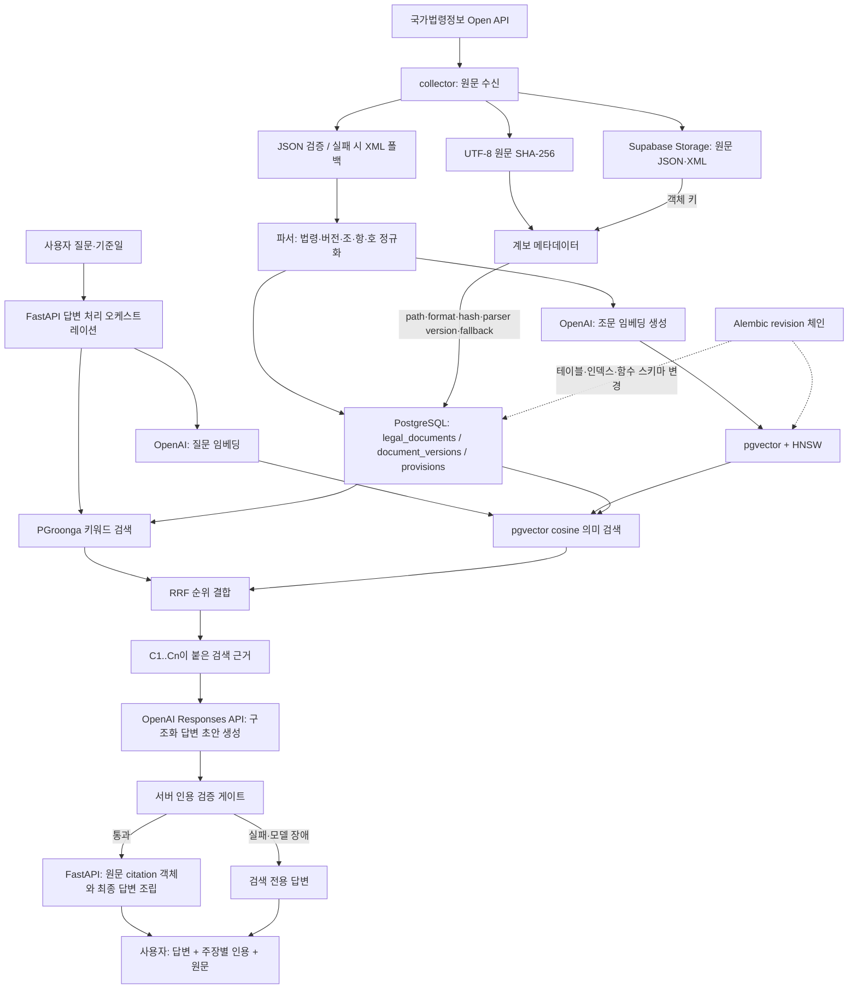

# 07 검색·원문 계보·답변 검증 기초

작성일: 2026-07-14
상태: 현재 구현 해설 및 후속 평가 항목

## 먼저 바로잡을 점: 512차원은 표준이 아니다

이 프로젝트의 `text-embedding-3-large` 512차원은 업계 표준이나 OpenAI 권장 고정값이 아니다. 현재 코드와 스키마에 선택되어 있지만, 저장소 안에는 256·512·1024·3072차원을 한국어 법령 평가셋으로 비교해 512를 확정한 기록이 없다. 따라서 현 단계에서는 **비용과 검색 품질 사이의 가정값**으로 취급해야 한다.

OpenAI에 따르면 `text-embedding-3-large`의 기본 최대 출력은 3072차원이며, `dimensions` 매개변수로 줄일 수 있다. 이 모델은 Matryoshka Representation Learning 계열 기법을 사용해 앞부분 차원만 사용해도 표현력을 어느 정도 유지하도록 훈련되었다. OpenAI가 공개한 예시는 256차원도 과거 1536차원 모델보다 MTEB에서 우수했다는 것이지, 모든 한국어 법률 검색에서 256이나 512가 최적이라는 뜻은 아니다.

512를 후보로 삼을 실용적 이유는 다음과 같다.

- 3072차원보다 벡터 본체가 1/6 크기다. pgvector의 `vector`는 대략 `4 × 차원 + 8`바이트이므로 벡터 하나가 512차원에서는 약 2,056바이트, 3072차원에서는 약 12,296바이트다. HNSW 인덱스 오버헤드는 별도다.
- 차원이 작으면 DB 저장 공간, 메모리, 네트워크 전송량과 거리 계산량이 줄어든다.
- 256보다 표현 용량을 더 남기는 중간 선택지다.
- pgvector HNSW의 `vector` 인덱스 지원 한도 2,000차원 안에 들어간다. 기본 3072차원은 그대로 `vector` HNSW 인덱스를 만들 수 없으므로 차원 축소나 `halfvec` 같은 별도 선택이 필요하다.

하지만 이 이유만으로 "적절하다"고 확정할 수 없다. 256·512·1024차원을 같은 조문, 같은 모델, 같은 검색 설정으로 생성하여 다음을 비교해야 한다.

1. 고정 한국어 법령 질의셋의 Recall@10과 nDCG@10
2. 키워드 검색과 결합한 최종 RRF 결과
3. HNSW 사용 전 정확 검색 대비 recall
4. 검색 지연시간, DB 크기와 인덱스 크기
5. 인용 게이트 통과율과 사람의 근거 적합성 평가

차원을 바꾸면 질문 벡터와 조문 벡터를 같은 모델·같은 차원으로 다시 생성하고, `embedding_version`과 인덱스 버전을 올려야 한다.

### 권위 자료와 한국어 해설

- [OpenAI — New embedding models and API updates](https://openai.com/index/new-embedding-models-and-api-updates/): `text-embedding-3-large`가 최대 3072차원이고 `dimensions`로 줄일 수 있으며, 작은 벡터는 정확도와 비용의 교환관계라는 공식 설명이다. **한국어 해설:** 작은 차원이 무료로 같은 품질을 보장하는 것이 아니라, 모델이 축약을 견디도록 학습되어 있으므로 애플리케이션 평가를 통해 비용 대비 품질을 선택할 수 있다는 뜻이다.
- [Kusupati et al. — Matryoshka Representation Learning](https://arxiv.org/abs/2205.13147): 여러 길이의 앞부분 표현이 유용하도록 학습하는 원 논문이다. **한국어 해설:** 긴 벡터 안에 짧은 벡터가 러시아 인형처럼 중첩되도록 훈련하여 하나의 모델이 여러 계산 예산을 지원한다.
- [pgvector 공식 README](https://github.com/pgvector/pgvector): 벡터 저장 크기, 거리 연산자와 HNSW 지원 차원 및 성능 교환관계를 설명한다. **한국어 해설:** PostgreSQL에서 정확 검색과 근사 검색을 선택할 수 있고, HNSW는 속도를 얻는 대신 일부 recall·메모리·구축 시간을 교환한다.

## Cosine 유사도와 거리

임베딩 `u`, `v`의 cosine similarity는 두 벡터 사이 각도의 코사인이다.

```text
cosine_similarity(u, v) = (u · v) / (||u|| × ||v||)
cosine_distance(u, v)   = 1 - cosine_similarity(u, v)
```

- 같은 방향에 가까우면 similarity가 1에 가까워진다.
- 직각이면 0에 가깝다.
- 반대 방향이면 -1에 가까워질 수 있다.
- 벡터의 절대 길이보다 방향을 비교하므로 문장 길이와 무관한 의미 방향 비교에 유용하다.

pgvector에서 `<=>`는 **cosine distance**다. 따라서 값이 작을수록 가깝고, similarity가 필요하면 `1 - distance`로 계산한다. 현재 프로젝트의 `ORDER BY embedding <=> query_embedding`은 가장 작은 거리부터 정렬한다.

### 권위 자료와 한국어 해설

- [SciPy — cosine distance](https://docs.scipy.org/doc/scipy/reference/generated/scipy.spatial.distance.cosine.html): 수식과 정의를 제공하는 과학 계산 라이브러리 공식 문서다. **한국어 해설:** 내적을 두 벡터의 길이로 나눠 방향 유사도를 구하고, 거리로 쓸 때는 1에서 뺀다.
- [pgvector 공식 README](https://github.com/pgvector/pgvector): PostgreSQL의 `<=>` 연산자가 cosine distance이며 similarity는 `1 - distance`라고 정의한다. **한국어 해설:** 우리 SQL에서 낮은 `<=>` 값이 더 관련 있는 후보라는 뜻이다.

## HNSW

HNSW는 `Hierarchical Navigable Small World`의 약자이며 고차원 벡터의 **근사 최근접 이웃 검색**을 위한 다층 그래프 인덱스다.

구성할 때 가까운 벡터끼리 그래프 간선으로 연결한다. 검색할 때는 연결이 적고 멀리 이동하기 쉬운 상위 계층에서 대략적인 영역을 찾고, 연결이 촘촘한 하위 계층으로 내려오며 후보를 좁힌다. 모든 조문과 정확히 비교하는 대신 가능성 높은 일부만 방문하므로 빠르다.

```text
상위 계층:  드문 장거리 연결로 관련 구역까지 빠르게 이동
                         ↓
중간 계층:  후보 구역을 축소
                         ↓
하위 계층:  촘촘한 이웃 중 가까운 벡터 반환
```

중요한 교환관계는 다음과 같다.

- 인덱스 없음: 느릴 수 있지만 정확 최근접 검색으로 perfect recall
- HNSW: 빠르지만 근사 검색이라 일부 정답 후보를 놓칠 수 있음
- `ef_search` 증가: 더 많은 후보를 방문하여 recall이 좋아질 수 있지만 느려짐
- `m`, `ef_construction` 증가: 인덱스 품질이 좋아질 수 있지만 구축 시간과 메모리 증가

법률 RAG에서는 HNSW 결과 자체를 정답으로 취급하지 않는다. 고정 평가셋에서 정확 검색 결과와 비교하여 Recall@10을 관리하고, 기준일 필터 때문에 후보가 과도하게 줄지 않는지도 검증해야 한다.

### 권위 자료와 한국어 해설

- [Malkov & Yashunin — Efficient and Robust Approximate Nearest Neighbor Search Using HNSW](https://doi.org/10.1109/TPAMI.2018.2889473): IEEE TPAMI에 게재된 HNSW 원 논문이다. **한국어 해설:** small-world 근접 그래프에 계층을 추가하여 높은 recall을 유지하면서 최근접 후보를 효율적으로 탐색하는 방법을 제안한다.
- [pgvector 공식 README — HNSW](https://github.com/pgvector/pgvector#hnsw): PostgreSQL 구현의 설정과 속도·recall·메모리 교환관계를 설명한다. **한국어 해설:** 프로젝트에서 실제 운영할 `m`, `ef_construction`, `ef_search`와 필터링 주의점을 확인하는 자료다.

## SHA-256으로 원문 변경을 감지하는 원리

SHA-256은 임의 길이의 입력을 256비트, 즉 보통 64자리 16진수 메시지 다이제스트로 결정적으로 변환한다.

1. 원문을 바이트열로 고정한다. 이 프로젝트는 현재 문자열을 UTF-8로 인코딩한다.
2. 패딩과 길이 정보를 붙여 512비트 블록으로 나눈다.
3. 각 블록을 32비트 단어, 비트 회전·이동, XOR, 덧셈과 압축 함수로 순차 처리한다.
4. 마지막 256비트 내부 상태를 다이제스트로 출력한다.

같은 바이트열은 항상 같은 해시를 만든다. 한 바이트라도 달라지면 이후 압축 단계 전체로 차이가 확산되어 일반적으로 완전히 다른 다이제스트가 나온다. 따라서 이전 해시와 새 해시가 다르면 원문 바이트가 달라졌다고 확정할 수 있다.

```text
old_hash != new_hash  → 원문이 변경됨
old_hash == new_hash  → 실무적으로 동일한 원문 바이트로 취급
```

두 다른 입력이 같은 SHA-256을 만드는 충돌은 수학적으로 가능하지만, 의도하지 않은 데이터 변경 감지에서 현실적으로 무시할 만큼 어렵다. 다만 SHA-256은 암호화가 아니므로 해시에서 원문을 복호화하는 용도도, 원문을 숨기는 용도도 아니다. 또한 JSON 공백이나 키 순서만 달라도 원시 바이트가 달라지므로 해시도 달라진다. 이 프로젝트의 `raw_sha256`은 **정규화된 의미**가 아니라 **수신·저장한 원문 바이트의 동일성**을 추적한다.

### 권위 자료와 한국어 해설

- [NIST FIPS 180-4 — Secure Hash Standard](https://csrc.nist.gov/pubs/fips/180-4/upd1/final): 미국 NIST가 정의한 SHA-256 공식 표준이다. **한국어 해설:** 메시지를 패딩하고 512비트 블록으로 처리하여 256비트 다이제스트를 만드는 정확한 알고리즘을 규정한다.
- [NIST Hash Functions 프로젝트](https://csrc.nist.gov/projects/hash-functions): 승인된 해시 표준과 메시지 다이제스트의 목적을 설명한다. **한국어 해설:** 해시는 메시지의 압축 표현이며 무결성 검증과 전자서명 같은 보안 기능의 기반이다.

## `parser_schema_version`은 어떻게 만들어졌나

이 값은 외부 기관이나 Supabase가 만드는 값이 아니다. **우리 파서 출력 계약의 버전을 개발자가 코드로 정한 문자열**이다.

현재 구현은 `LegalDocumentRecord`에 다음과 같이 기본값을 직접 선언한다.

```python
parser_schema_version: str = "1"
```

JSON·XML 파서가 별도 값을 지정하지 않으면 모두 `"1"`이 저장된다. 따라서 현재 값은 자동으로 코드 변경을 감지하거나 Git 커밋을 계산한 결과가 아니다.

다음 변경이 파싱 결과의 의미나 구조를 바꾸면 개발자가 버전을 올려야 한다.

- 조·항·호·목 분리 규칙 변경
- 시행일·공포일 해석 변경
- 보칙·부칙 처리 변경
- 공백이나 번호 정규화가 검색 결과에 영향을 주는 변경
- JSON/XML이 같은 도메인 객체로 수렴하는 규칙 변경

반대로 로그 문구, 네트워크 재시도처럼 출력 데이터가 같다면 올릴 필요가 없다. 장기적으로는 `"1"`보다 `legal-document-v1` 같은 명시적 상수를 두고, 파서 계약 테스트와 재색인 절차에 연결하는 것이 안전하다.

## 원문 Storage와 파싱 DB를 둘 다 저장하는 이유

질문의 이해가 맞다. 목표 구조에서는 collector가 한 번 받은 응답으로 두 종류의 데이터를 만든다.

```text
국가법령정보 API 응답
        ├─ 원문 그대로 ───────────────> Storage 객체
        └─ 검증·파싱 ────────────────> DB의 법령·버전·조문 행

collector가 함께 만든 계보 메타데이터
        └─ raw_storage_path, raw_format, raw_sha256,
           parser_schema_version, fallback_reason ─> document_versions 행
```

Storage가 스스로 정보를 다시 DB로 보내는 것이 아니다. collector가 원문을 Storage에 올리고 그 객체 키와 처리 메타데이터를 DB에 기록한다.

- Storage 원문: 당시 실제로 받은 JSON/XML을 손실 없이 보존
- DB 조문: 검색·필터·인용에 적합한 구조화 데이터
- DB 계보 메타데이터: 구조화 데이터가 어느 원문과 파서에서 왔는지 연결

둘 다 필요한 이유는 검색 성능과 감사 가능성의 요구가 다르기 때문이다. JSON/XML 원문만으로 매 질문마다 검색하면 느리고 구조가 불안정하다. 파싱된 DB만 남기면 파서 버그가 발견되었을 때 원문을 재처리하거나 결과의 출처를 증명하기 어렵다.

## DB 마이그레이션 도구의 공통 로직과 현재 Alembic 방식

DB 마이그레이션 도구는 언어나 DBMS가 달라도 보통 다음 구조를 공유한다.

1. 개발자가 순서가 있는 변경 단위(revision/change set)를 만든다.
2. 각 변경에는 테이블·열·인덱스·제약·데이터 변환 SQL 또는 API 호출이 들어간다.
3. DB 안의 전용 이력 테이블이 적용한 revision과 성공 여부를 기록한다.
4. 실행기는 코드에 있는 revision과 DB 이력을 비교한다.
5. 아직 적용하지 않은 revision만 의존 순서대로 실행한다.
6. 실패하면 가능한 DB에서는 트랜잭션을 롤백하고 실패 상태를 남긴다.
7. 이미 배포된 revision을 수정하지 않고 새 revision으로 앞으로 이동하는 것이 기본 원칙이다.

자동 생성 기능이 있는 도구는 여기에 `현재 DB 스키마 ↔ 코드의 목표 스키마 모델` 비교를 추가하여 후보 migration을 만든다. 그러나 이름 변경을 삭제+추가로 오해하거나 DB 전용 함수·인덱스를 놓칠 수 있으므로 사람이 검토해야 한다.

Alembic 공식 문서도 autogenerate 결과를 완성본이 아닌 **candidate migration**이라고 부른다. DB reflection으로 현재 테이블 정보를 읽고 SQLAlchemy `MetaData`와 비교하여 열 추가·삭제·타입 차이 등을 제안한다.

현재 프로젝트는 이 자동 감지를 사용하지 않는다. `migrations/env.py`에 `target_metadata`가 없고, `0001_legal_corpus.py`에서 `op.execute()`로 PostgreSQL·PGroonga·pgvector 전용 SQL을 사람이 직접 작성했다. Alembic은 다음만 담당한다.

```text
DB의 alembic_version 확인
        ↓
코드의 revision 체인과 비교
        ↓
미적용 revision의 upgrade()를 순서대로 실행
        ↓
성공한 revision 번호 기록
```

### 권위 자료와 한국어 해설

- [Alembic — Auto Generating Migrations](https://alembic.sqlalchemy.org/en/latest/autogenerate.html): DB 스키마와 SQLAlchemy `MetaData`를 비교해 후보 변경을 생성하고 사람이 검토해야 한다고 설명한다.
- [Flyway — Versioned migrations](https://documentation.red-gate.com/flyway/flyway-concepts/migrations/versioned-migrations): 언어와 ORM에 덜 의존적인 마이그레이션 도구의 공통 원리를 보여준다. **한국어 해설:** 버전이 붙은 변경을 순서대로 한 번만 실행하고 이력 테이블과 checksum으로 적용 여부와 변경 훼손을 검사한다.

## RRF

RRF는 `Reciprocal Rank Fusion`으로, 서로 점수 체계가 다른 여러 검색 결과를 **순위만 사용하여 결합**하는 방법이다.

현재 프로젝트에서는 PGroonga 점수와 cosine 거리를 직접 더하지 않는다. 두 값은 단위와 분포가 다르기 때문이다. 대신 각 검색에서 몇 등인지 사용한다.

```text
RRF 점수(d) = Σ 1 / (k + rank_i(d))
```

현재 SQL은 `k = 60`을 사용한다.

예를 들어 어떤 조문이 키워드 검색 1등, 의미 검색 3등이면:

```text
1 / (60 + 1) + 1 / (60 + 3)
```

두 검색에서 모두 상위권인 문서가 유리하고, 한 검색에서만 발견된 문서도 사라지지 않는다. `k=60` 역시 절대 표준이 아니라 평가셋으로 검증할 검색 설정값이다.

- [Cormack, Clarke & Buettcher — Reciprocal Rank Fusion Outperforms Condorcet and Individual Rank Learning Methods](https://cormack.uwaterloo.ca/cormacksigir09-rrf.pdf): RRF 원 논문이다. **한국어 해설:** 서로 다른 검색 시스템의 점수를 보정하려 애쓰기보다 각 결과의 역순위 값을 합쳐 강건한 최종 순위를 만든다.

## 인용 ID, 답변 처리와 인용 검증 게이트

### 인용 ID를 포함한다는 뜻

검색 결과 10개를 모델에 보낼 때 API가 요청 단위의 임시 ID를 붙인다.

```text
[C1] 전기사업법 제7조 ...원문...
[C2] 전기사업법 시행규칙 제... ...원문...
```

모델은 실질 주장마다 `citation_ids: ["C1"]`처럼 어떤 근거를 사용했는지 반환해야 한다. C1은 법령 자체의 영구 ID가 아니라 **이번 답변에서 검색 결과와 주장을 연결하는 표시 ID**다. 최종 응답에서는 C1을 `provision_id`, 법령명, 버전, 조문 경로, 정확한 원문과 연결한다.

### 답변 처리는 어디에 있는가

답변 처리는 RRF 뒤와 인용 게이트 앞에 있다. `OpenAIAnswerer.answer()`가 검색 근거를 Responses API에 보내고 구조화된 `DraftAnswer`를 받는다. 게이트 통과 후 FastAPI가 신뢰 가능한 citation 객체를 서버에서 다시 조립하여 최종 `QuestionResponse`를 만든다.

### 현재 인용 검증 게이트 로직

현재 `validate_draft()`는 모델을 다시 호출하지 않는 결정적 규칙이다.

1. 검색 결과와 답변 section·checklist가 비어 있으면 실패
2. 모든 section과 checklist에 citation ID가 있어야 함
3. citation ID가 실제 이번 검색 결과 C1..Cn 안에 있어야 함
4. 주장·설명의 일반어를 제외한 핵심 용어 중 최소 절반이 인용 원문에 있어야 함
5. `허가`, `신고`, `등록`, `금지`, `면제`, `검사`, 형벌 같은 규범어를 주장하면 인용 원문에도 직접 있어야 함
6. 주장에 나온 모든 숫자가 인용 원문에도 있어야 함
7. 하나라도 실패하면 AI 초안을 버리고 검색 전용 응답으로 폴백

이 게이트는 법률 의미가 완전히 일치하는지 이해하는 판정기가 아니다. 존재하지 않는 인용, 무관한 근거, 근거에 없는 의무 유형이나 숫자를 보수적으로 차단하는 하한선이다.

## 수정된 전체 흐름



## 현재 코드에서 확인할 위치

- 임베딩 차원 설정: `apps/api/app/settings.py`
- 임베딩 API 호출: `apps/api/app/adapters/openai_embedder.py`
- 파서 버전 기본값: `packages/law-rag-core/src/law_rag_core/domain/entities.py`
- 원문 해시 생성: `packages/law-rag-core/src/law_rag_core/parsers/law_json.py`, `law_xml.py`
- 목업 원문과 계보 저장: `apps/collector/src/law_rag_collector/repository.py`
- PostgreSQL 저장과 검색: `apps/api/app/adapters/postgres_repository.py`
- RRF·HNSW·PGroonga 스키마: `apps/api/migrations/versions/0001_legal_corpus.py`
- 답변 생성과 인용 게이트: `apps/api/app/adapters/openai_answerer.py`
- 전체 질문 처리: `apps/api/app/main.py`의 `question()`

## 다음 검증 과제

- 256·512·1024차원 한국어 법령 검색 평가를 실행해 512 선택을 확정하거나 변경
- HNSW exact search 대비 Recall@10과 기준일 필터 후 결과 수 측정
- `parser_schema_version`을 명시적 상수와 재처리 정책으로 승격
- Supabase Storage 업로드와 DB 반영 사이 부분 실패 복구 절차 설계
- 인용 게이트의 오탐·미탐을 사람 평가로 측정
